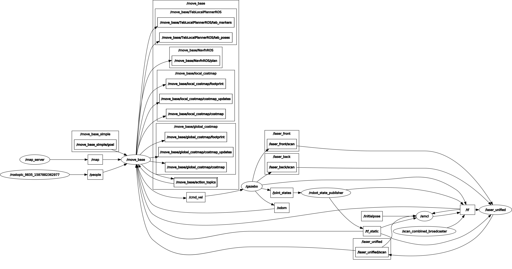

#### Table of contents
- [Prerequisites](#Prerequisites)
- [rqt_graph](#rqt_graph)
- [Simulation of Navigation Stack (Navigation)](#Simulation-of-navigation-stack-navigation)
- [Simulation of Navigation Stack (SLAM)](#Simulation-of-navigation-stack-SLAM)
- [Plugin](#Plugin)
- [Installation of Gazebo 13](#Installation-of-Gazebo-13)
- [Important information](#Important-information)
- [Troubleshooting](#Troubleshooting)

<br>

## Prerequisites
- **Ubuntu 18.04 with Melodic ROS distribution** is required for installation of Gazebo 9.1 or higher. Click [here](http://releases.ubuntu.com/18.04.4/?_ga=2.30273727.1896459521.1588157994-1099108351.1588060257) for Ubuntu 18.04 installation guide. Click [here](http://wiki.ros.org/melodic/Installation/Ubuntu) for ROS installation guide for Melodic.
- **Gazebo 9.1 or higher** is required for collision on actor to work. Click [here](#Installation-of-Gazebo-13)  for installation guide.

<br>

## rqt_graph
The following figure will show the rqt_graph connected to the developed navigation stack (neo_ws).


<br>


## Simulation of Navigation Stack (Navigation)

- Launch Gazebo with loaded robot model and world.
```c
roslaunch neo_simulations {launch_file_name}
```

- Launch Navigation Stack 
```c
    roslaunch neo_2dnav 2dnav.launch
```
<br>

## Simulation of Navigation Stack (SLAM)
- Launch Gazebo with loaded robot model and world.
```c
roslaunch neo_simulations {launch_file_name}
```

- Launch SLAM
```c
    roslaunch neo_2dnav nav2dslam.launch
```
<br>

## Plugin
The plugin should be installed when downloading the repository. To tell Gazebo where to find the plugin, insert this line to the terminal (with your own workspace path instead of `{ws_path}`) 

```c
echo 'export GAZEBO_PLUGIN_PATH=$GAZEBO_PLUGIN_PATH:{ws_path}/actor_collisions/build' >> ~/.bashrc
``` 

Restart the terminal or run this command `. ~/.bashrc` 

<br>

## Installation of Gazebo 13
1. Open a terminal and type in the following command to setup your computer to accept software from packages.osrfoundation.org.
```c
sudo sh -c 'echo "deb http://packages.osrfoundation.org/gazebo/ubuntu-stable `lsb_release -cs` main" > /etc/apt/sources.list.d/gazebo-stable.list'
```

2. Setup keys
```c
wget https://packages.osrfoundation.org/gazebo.key -O - | sudo apt-key add -
```

3. Install Gazebo 13.0
```c
sudo apt-get update && sudo apt-get install gazebo9=9.13.0-1*
```

4. You might have to use the following line to make the installation work
```c
sudo apt upgrade
```
<br>

## Important information
**Beware of duplicates on your system**
This package contains the following external packages:
- [ROS navigation stack](http://wiki.ros.org/navigation)
- [teb_local_planner](http://wiki.ros.org/teb_local_planner)
- [social_navigation_layers](http://wiki.ros.org/social_navigation_layers)
- [people_msgs](http://wiki.ros.org/people_msgs)

If you have already installed some of these packages on your system, we recommend uninstalling them from your system and instead use the version in this package. It is also possible to remove the listed packages manually from the P6 package, but there is no guarantee that the package will be "plug and play".

<br>

## Troubleshooting
- If `catkin_make` doesn't work!

In terminal, write `source /opt/ros/melodic/setup.bash`
